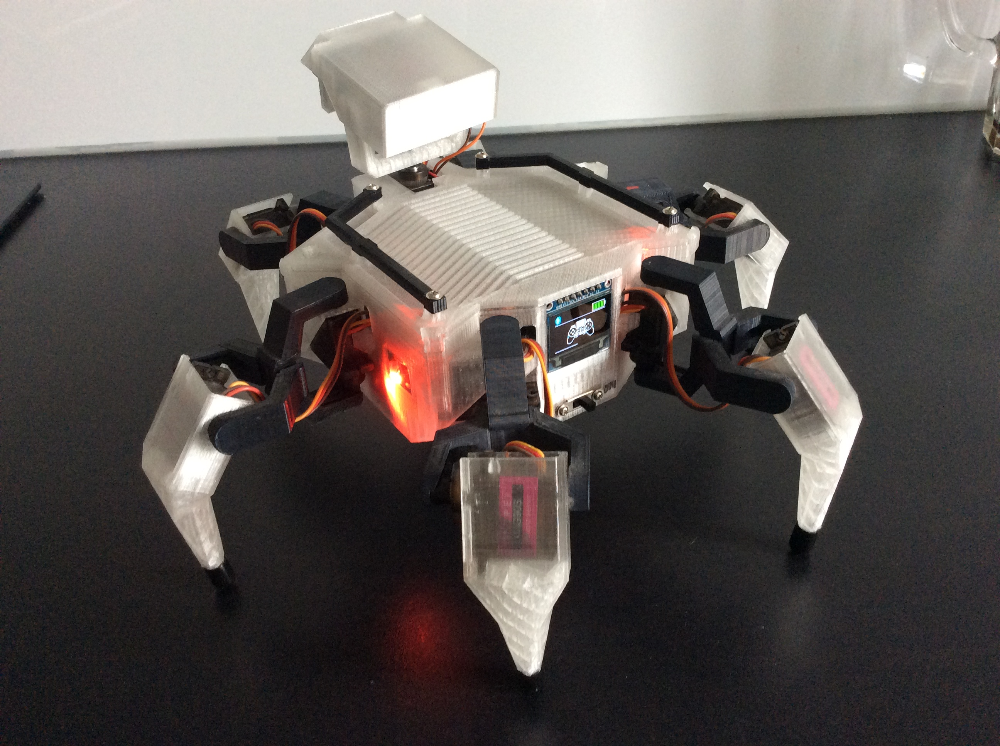

# Hexapod
This is the code for my 12 + 2 DOF Hexapod. It is written with Visual Studio Code and PlatformIO.

Don´t expect this to run on your system. There are some dependencies to other librarys you probably don´t have. 
I uploaded it anyway because maybe some Ideas in my code are helpfull for others programming a 12 DOF robot.

The 3D parts of the robot on Thingiverse:
https://www.thingiverse.com/thing:4445160

